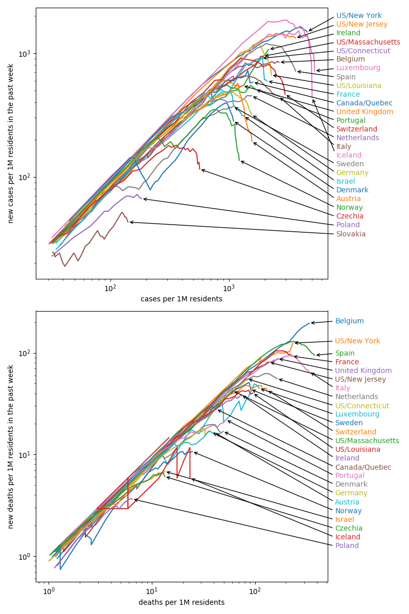

I like the plots on [aatishb.com](https://aatishb.com/covidtrends/), but I miss the option to compare US states with the world's countries, and most importantly normalization to country size.

The shown countries/states are those with the most total confirmed cases and more than 200k inhabitants, plus some central European countries that I’m personally interested in.

