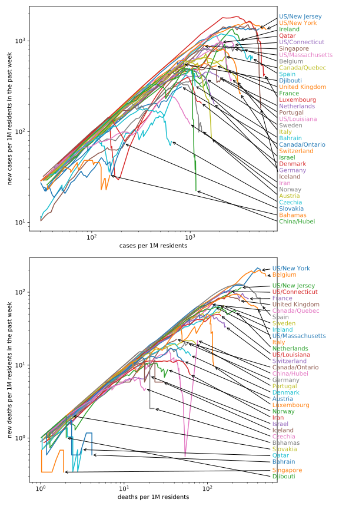

I like the plots on [aatishb.com](https://aatishb.com/covidtrends/), but I miss the option to compare US states with the world's countries, and most importantly normalization to country size.

The shown countries/states are those with at least 200k inhabitants and among the 30 highest in at least one statistic of “new cases”, “total cases”, “new deaths”, and “total deaths”, plus Czechia and Slovakia, with a limit of 5 states/provinces per country.

